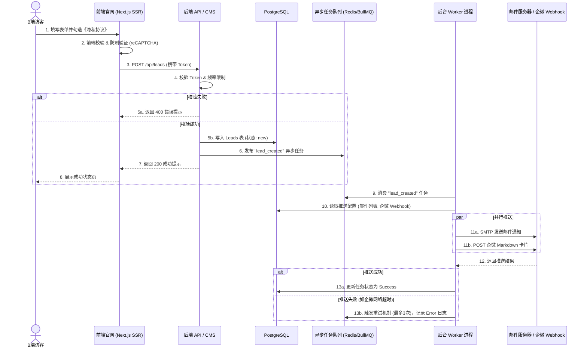

## 产品需求文档 (PRD)：ToB 认证行业通用型配置化官网

**文档版本**：V 1.0
**最后更新**：2026-06-17
**产品负责人**：Senior PM Analyst
**目标受众**：研发团队 (Frontend/Backend)、UI/UX 设计师、QA 测试工程师、项目干系人

---

## 1. 项目概述 (Project Overview)

### 1.1 业务背景

公司主营 ISO9000 等企业认证业务，核心受众为 B 端企业客户。当前需要构建一个具备高度专业信任感的企业官网，以建立品牌背书并获取高质量的销售线索（留资）。同时，为降低未来同类项目的开发成本，系统需采用**配置驱动 (Configuration-Driven)** 架构，实现“一套代码，多套配置”的适度复用。

### 1.2 核心目标 (SMART)

* **业务目标**：构建稳定的线上获客渠道，提升表单留资转化率。
* **技术目标**：实现 100% 核心页面服务端渲染 (SSR)，确保搜索引擎极致收录；实现前后端分离的 Headless CMS 架构。
* **体验目标**：首屏加载时间 (LCP) < 2.5 秒，支持中英双语无缝切换。

### 1.3 范围定义 (Scope Boundary)

* **In-Scope (包含)**：
  * PC/移动端响应式前台官网（首页、认证项目、案例、新闻、留资表单）。
  * 支持双角色权限 (RBAC) 的 Headless 后台管理系统。
  * 表单线索的多渠道异步推送（站内、邮件、企微 Markdown 卡片）。
  * 中英双语支持（带内容降级 Fallback 机制）。
* **Out-of-Scope (不包含)**：
  * C 端用户的注册/登录/个人中心体系。
  * 在线支付与电商交易闭环。
  * 类似 Wix 的自由拖拽式低代码页面搭建引擎。

---

## 2. 用户角色与权限矩阵 (RBAC)

| 角色标识        | 角色名称                            | 核心职责 (Jobs-to-be-Done)                     | 系统权限边界                                                                                                                            |
| :-------------- | :---------------------------------- | :--------------------------------------------- | :-------------------------------------------------------------------------------------------------------------------------------------- |
| `ROLE_ADMIN`  | **网站运维 (SysAdmin)**       | 确保网站技术健康、SEO 策略落地、系统复用配置。 | **全局配置**：站点基础信息、SEO Meta 模板、导航菜单、数据字典。`<br>`**系统管理**：账号分配、推送通道配置、操作日志审计。 |
| `ROLE_EDITOR` | **内容管理 (Content Editor)** | 持续输出专业内容，维护信任背书，跟进客户线索。 | **内容管理**：Banner、认证项目、新闻/案例的增删改查。`<br>`**线索管理**：查看、导出、标记处理状态客户留资数据。           |

---

## 3. 信息架构 (Information Architecture)

### 3.1 前台站点地图 (Site Map)

* **首页 (Home)**：品牌定调、核心优势、主营认证项目入口、客户信任墙、底部留资 CTA。
* **认证服务 (Services)**：
  * 列表页：所有认证项目（ISO9001, ISO14001 等）概览。
  * 详情页：项目介绍、适用企业、认证流程、**专属留资表单**。
* **成功案例 (Cases)**：客户 Logo 墙、详细审核案例图文。
* **行业洞察 (Insights)**：新闻动态、认证政策解读（博客列表与详情）。
* **关于我们 (About)**：公司资质、专家团队、发展历程。
* **联系我们 (Contact)**：通用咨询表单、公司地址与地图。

### 3.2 后台管理菜单 (Admin Menu)

* **工作台 (Dashboard)**：今日新增线索统计、快捷入口。
* **全局设置 (Settings)**：站点信息、SEO 配置、导航管理、推送通道配置。
* **内容中心 (Content)**：Banner 管理、服务项目管理、案例管理、文章管理。
* **线索中心 (Leads)**：留资数据列表、状态流转看板。

---

## 4. 核心业务流程 (Core Business Flows)

### 4.1 B端客户留资与异步推送流

此流程确保了高并发下的系统稳定性，以及第三方接口异常时不影响主业务流程。



---

## 5. 详细功能需求与数据字典 (Detailed Requirements)

### 5.1 多语言与内容降级机制 (i18n Fallback)

* **需求描述**：系统支持 `/zh` 和 `/en` 路由。考虑到英文内容维护成本高，后台编辑时英文字段非必填。
* **前台渲染逻辑**：当访客处于 `/en` 环境，若 API 返回的 `title.en` 为空，前端自动降级读取 `title.zh` 渲染。
* **SEO 约束**：即使降级显示中文，HTML 根节点必须保持 `<html lang="en">`，且必须注入正确的 `<link rel="alternate" hreflang="en" href="..." />` 标签。

### 5.2 核心数据字典 (Data Dictionary)

#### 表 1：认证项目表 (`services`)

| 字段名称       | 数据类型 | 长度/限制 | 必填 | 默认值                       | 业务说明                                       |
| :------------- | :------- | :-------- | :--: | :--------------------------- | :--------------------------------------------- |
| `id`         | UUID     | 36        |  是  | Auto                         | 主键                                           |
| `slug`       | VARCHAR  | 50        |  是  | -                            | URL 别名 (如 `iso-9001`)，中英文必须保持一致 |
| `title`      | JSONB    | -         |  是  | `{"zh":"", "en":""}`       | 多语言标题                                     |
| `content`    | JSONB    | -         |  是  | `{"zh":"", "en":""}`       | Tiptap 富文本 HTML 内容                        |
| `seo_meta`   | JSONB    | -         |  否  | `{"zh":{...}, "en":{...}}` | 独立 TDK 配置                                  |
| `sort_order` | INT      | -         |  是  | 0                            | 列表排序权重                                   |
| `status`     | ENUM     | -         |  是  | 'draft'                      | 'draft', 'published'                           |

#### 表 2：线索表 (`leads`)

| 字段名称         | 数据类型  | 长度/限制 | 必填 | 默认值  | 业务说明                                   |
| :--------------- | :-------- | :-------- | :--: | :------ | :----------------------------------------- |
| `id`           | BIGINT    | -         |  是  | Auto    | 主键                                       |
| `name`         | VARCHAR   | 50        |  是  | -       | 客户姓名                                   |
| `phone`        | VARCHAR   | 20        |  是  | -       | 手机号 (数据库层加密存储)                  |
| `company`      | VARCHAR   | 100       |  否  | -       | 公司名称                                   |
| `service_slug` | VARCHAR   | 50        |  是  | -       | 意向项目关联                               |
| `source_url`   | VARCHAR   | 255       |  是  | -       | 来源页面 URL                               |
| `status`       | ENUM      | -         |  是  | 'new'   | 'new', 'contacted', 'converted', 'invalid' |
| `created_at`   | TIMESTAMP | -         |  是  | Current | 提交时间                                   |

### 5.3 企微机器人推送格式规范

后端调用企微 Webhook 时，必须拼装以下 Markdown 格式 Payload：

```json
{
    "msgtype": "markdown",
    "markdown": {
        "content": "### 🔔 新认证咨询线索\n> **客户姓名**: <font color=\"info\">{name}</font>\n> **联系电话**: [{phone}](tel:{phone})\n> **意向项目**: {service_name}\n> **来源页面**: [{source_url}]({source_url})\n\n[👉 点击前往后台跟进](https://admin.company.com/leads/{id})"
    }
}
```

---

## 6. 非功能性需求 (Non-Functional Requirements)

### 6.1 SEO 与性能 (SEO & Performance)

* **渲染架构**：前端必须采用 **Next.js (App Router)**，核心页面使用 SSG (静态生成) 或 SSR (服务端渲染)，严禁使用纯客户端渲染 (CSR) 获取核心文本数据。
* **结构化数据**：首页和认证项目详情页必须注入 `JSON-LD` (Organization, Service, FAQPage) 以富化搜索结果展示。
* **图片优化**：后台上传的图片必须经过云存储（如 OSS）自动压缩并转换为 **WebP** 格式，前台使用 `next/image` 组件实现懒加载。

### 6.2 安全与合规 (Security & Compliance)

* **隐私合规 (PIPL)**：所有留资表单提交按钮上方，必须包含强制勾选的“我已阅读并同意《隐私政策》”复选框。
* **接口防刷**：表单提交接口必须接入 reCAPTCHA 或极验验证码，并在后端设置单 IP 频率限制（如 1次/分钟）。
* **凭证安全**：企微 Webhook URL 和 SMTP 密码**严禁**硬编码或存储在前端，必须存储于后端服务器的环境变量 (`.env`) 中。

### 6.3 技术栈建议 (Recommended Tech Stack)

* **Frontend**: Next.js (React), TailwindCSS, Tiptap (富文本渲染)
* **Backend/CMS**: Strapi / Directus (Headless CMS) 或 NestJS 自研
* **Database**: PostgreSQL (利用 JSONB 处理多语言)
* **Queue**: Redis + BullMQ (处理异步推送)

---

## 7. 验收标准 (Acceptance Criteria - Gherkin)

### 场景 1：多语言降级渲染与 SEO 保护

```gherkin
Feature: 多语言内容降级与 SEO 标签
  Background:
    Given 后台配置了 "ISO9001" 项目，中文标题为 "ISO9001 认证"，英文标题为空
    And 网站支持 "/zh" 和 "/en" 路由

  Scenario: 英文路由下触发内容降级
    When 访客访问 "/en/services/iso-9001"
    Then 页面 HTTP 状态码应为 200
    And 页面主标题 (H1) 应降级显示为中文 "ISO9001 认证"
    And 页面 HTML 根节点必须包含 lang="en" 属性
    And 页面 <head> 中必须包含 <link rel="alternate" hreflang="en" href="..." /> 标签
```

### 场景 2：表单防刷与异步推送容错

```gherkin
Feature: 表单提交与异步任务容错
  Background:
    Given 访客在 "ISO9001" 页面填写了有效表单
    And 后台配置的企微 Webhook URL 处于网络超时状态

  Scenario: 第三方推送失败不应阻断主流程
    When 访客勾选隐私协议并点击 "提交"
    Then 前端应在 2 秒内显示 "提交成功" 提示
    And 数据库 "leads" 表应成功写入该条数据
    And 后台 "系统日志" 中应记录一条企微推送失败的 Error 日志
    And 系统应在 1 分钟后自动触发该推送任务的第一次重试
```

---

## 8. 附录：风险登记册与下一步计划 (Risks & Next Steps)

### 8.1 潜在风险 (Risk Register)

| 风险项                      | 影响程度 | 缓解措施 (Mitigation)                                                                            |
| :-------------------------- | :------: | :----------------------------------------------------------------------------------------------- |
| **SEO 重复内容惩罚**  |   High   | 强制约束中英文 URL 的 `slug` 必须绝对一致；严格审查 `<head>` 中的 hreflang 标签注入逻辑。    |
| **企微 Webhook 泄露** |   High   | 代码审查 (Code Review) 阶段必须检查 Webhook 凭证是否仅存在于后端环境变量中；接口层增加内部鉴权。 |
| **邮件进垃圾箱**      |  Medium  | 弃用普通企业邮箱 SMTP，采用专业邮件推送服务（如 SendGrid/阿里云），并配置 SPF/DKIM 记录。        |

### 8.2 下一步行动计划 (Next Steps)

1. **技术评审 (Tech Review)**：研发团队基于本 PRD 第 6 节进行技术栈选型与架构评审，输出技术方案设计文档 (TDD)。
2. **UI/UX 设计**：设计师输出高保真 Figma 原型，重点验收多语言切换交互、表单提交流程及企微卡片的视觉预览。
3. **环境准备**：运维团队完成云服务器、OSS 存储、Redis 队列及第三方推送服务的账号申请与网络打通。
