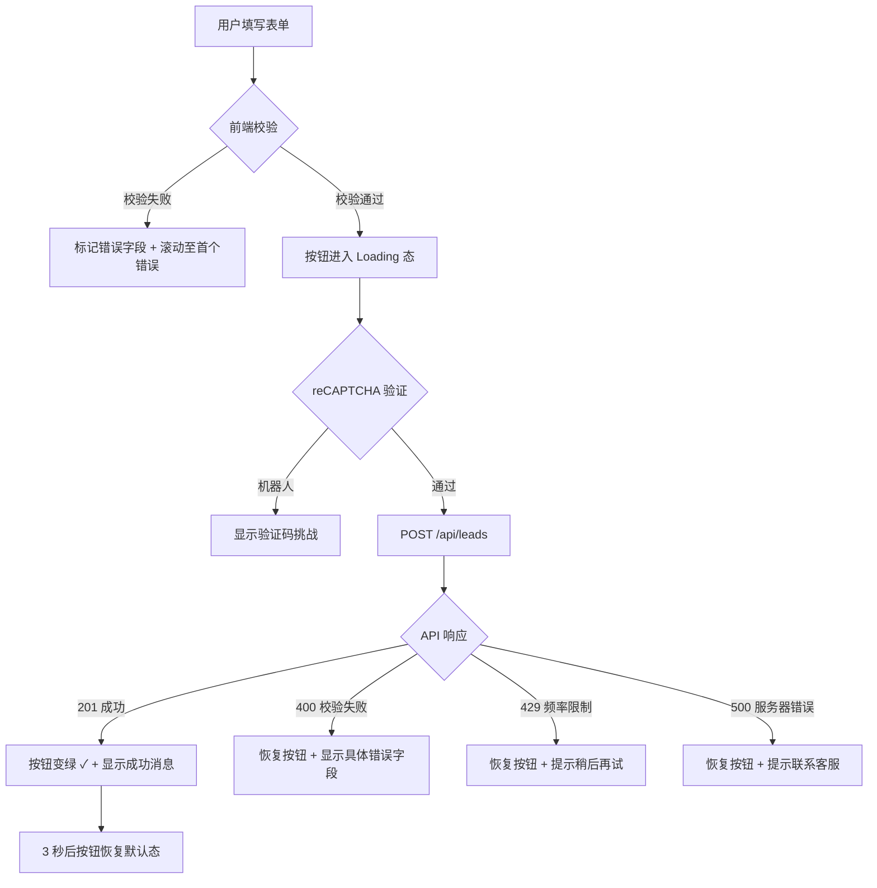
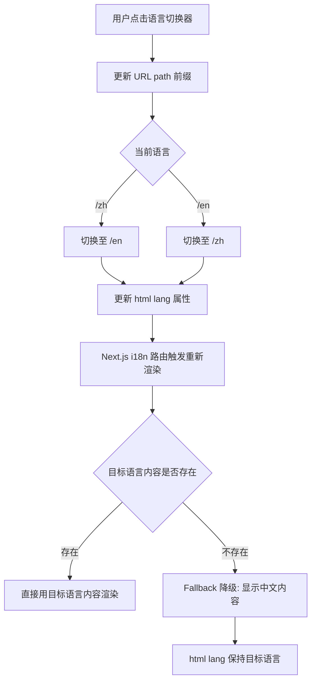

# ToB 认证行业通用型配置化官网 -- UI 设计规范文档

**文档版本**：V 1.0
**最后更新**：2026-06-17
**文档类型**：高保真 UI 设计规范 (Design Specification)
**目标受众**：前端开发工程师、UI 设计师、QA 测试工程师
**关联文档**：`docs/PRD.md`

---

## 目录

1. [设计理念与品牌策略](#1-设计理念与品牌策略)
2. [设计系统 -- Design System](#2-设计系统----design-system)
   - 2.1 [色彩体系](#21-色彩体系)
   - 2.2 [字体体系](#22-字体体系)
   - 2.3 [间距系统](#23-间距系统)
   - 2.4 [圆角规范](#24-圆角规范)
   - 2.5 [阴影规范](#25-阴影规范)
   - 2.6 [图标规范](#26-图标规范)
3. [组件库 -- Component Library](#3-组件库----component-library)
   - 3.1 [按钮 Button](#31-按钮-button)
   - 3.2 [输入框 Input](#32-输入框-input)
   - 3.3 [选择器 Select](#33-选择器-select)
   - 3.4 [复选框 Checkbox / 单选框 Radio](#34-复选框-checkbox--单选框-radio)
   - 3.5 [开关 Switch](#35-开关-switch)
   - 3.6 [卡片 Card](#36-卡片-card)
   - 3.7 [标签 Tag / 徽章 Badge](#37-标签-tag--徽章-badge)
   - 3.8 [导航 Navigation](#38-导航-navigation)
   - 3.9 [页脚 Footer](#39-页脚-footer)
   - 3.10 [面包屑 Breadcrumb](#310-面包屑-breadcrumb)
   - 3.11 [分页 Pagination](#311-分页-pagination)
   - 3.12 [模态框 Modal](#312-模态框-modal)
   - 3.13 [消息提示 Toast](#313-消息提示-toast)
   - 3.14 [表格 Table](#314-表格-table)
   - 3.15 [加载状态 Loading](#315-加载状态-loading)
   - 3.16 [空状态 Empty State](#316-空状态-empty-state)
   - 3.17 [语言切换器 Language Switcher](#317-语言切换器-language-switcher)
4. [前台页面布局设计](#4-前台页面布局设计)
   - 4.1 [首页 Home](#41-首页-home)
   - 4.2 [认证服务列表页 Services List](#42-认证服务列表页-services-list)
   - 4.3 [认证服务详情页 Service Detail](#43-认证服务详情页-service-detail)
   - 4.4 [成功案例页 Cases](#44-成功案例页-cases)
   - 4.5 [行业洞察列表页 Insights List](#45-行业洞察列表页-insights-list)
   - 4.6 [行业洞察详情页 Insight Detail](#46-行业洞察详情页-insight-detail)
   - 4.7 [关于我们 About](#47-关于我们-about)
   - 4.8 [联系我们 Contact](#48-联系我们-contact)
   - 4.9 [全局导航 Global Navigation](#49-全局导航-global-navigation)
   - 4.10 [全局页脚 Global Footer](#410-全局页脚-global-footer)
5. [后台管理页面设计](#5-后台管理页面设计)
   - 5.1 [工作台 Dashboard](#51-工作台-dashboard)
   - 5.2 [全局设置 Settings](#52-全局设置-settings)
   - 5.3 [内容中心 Content Center](#53-内容中心-content-center)
   - 5.4 [线索中心 Leads Center](#54-线索中心-leads-center)
6. [响应式断点策略](#6-响应式断点策略)
7. [交互与动画规范](#7-交互与动画规范)
8. [Design Tokens 命名规范](#8-design-tokens-命名规范)
9. [无障碍规范 (WCAG 2.1 AA)](#9-无障碍规范-wcag-21-aa)
10. [开发实施检查清单](#10-开发实施检查清单)

---

## 1. 设计理念与品牌策略

### 1.1 设计关键词

| 关键词 | 设计转化 |
|--------|----------|
| **专业权威** | 深蓝色主调、严谨的网格对齐、克制的装饰元素 |
| **可信赖** | 充分的留白、清晰的层级、真实客户 Logo 展示、资质证书视觉化 |
| **国际化** | 中英双语无缝体验、符合国际阅读习惯的排版节奏 |
| **现代大气** | 大尺寸 Hero 区、微妙的渐变与阴影、流畅的微交互动画 |
| **高效获客** | 视觉焦点引导至 CTA 按钮、留资表单零摩擦设计 |

### 1.2 品牌人格 (Brand Archetype)

以 **"智者 (The Sage)"** 为主，**"守护者 (The Caregiver)"** 为辅：
- 智者：用数据和专业内容建立权威，例如认证通过率统计、政策解读深度文章
- 守护者：用温暖的微交互和清晰的流程引导，降低企业客户的决策焦虑

### 1.3 视觉参考方向

- 参考调性：IBM、麦肯锡、SGS 官网——简洁、信息密度适中、蓝色主导
- 差异化：比传统认证机构更现代，比纯 SaaS 产品更稳重

---

## 2. 设计系统 -- Design System

### 2.1 色彩体系

#### 2.1.1 品牌主色 (Brand Primary)

深蓝色系，传递"专业、稳重、国际权威"的品牌感知。蓝色在商业语境中天然关联信任与安全感，深蓝相较浅蓝更具权威性，适合 B 端认证行业。

```
Primary Scale:
--color-primary-50:  #EFF4FE   /* 极浅蓝，用于信息提示背景 */
--color-primary-100: #D6E3FC   /* 浅蓝，用于选中态背景、表格 hover */
--color-primary-200: #AEC7FA   /* 中浅蓝，用于标签背景 */
--color-primary-300: #85ABF7   /* 中蓝，用于次要边框 */
--color-primary-400: #5C8FF5   /* 亮蓝，用于图标、链接 */
--color-primary-500: #1A56DB   /* 主色 —— 核心品牌色，CTA 按钮、关键图标 */
--color-primary-600: #1647BF   /* 深蓝，hover 态 */
--color-primary-700: #1238A3   /* 更深蓝，pressed 态 */
--color-primary-800: #0E2987   /* 极深蓝，用于深色背景上的文字 */
--color-primary-900: #0A1A6B   /* 最深蓝，极少使用，仅用于特殊强调 */
```

**设计依据**：Primary-500 `#1A56DB` 在白底上对比度约为 4.6:1（大文本达标），在黑底上对比度约为 4.5:1。Primary-700 以上的色阶在白底上对比度均超过 4.5:1，满足 WCAG AA 正文文本要求。

#### 2.1.2 中性色 (Neutral)

冷灰调，确保文本层级清晰、背景区域可区分。

```
Neutral Scale:
--color-neutral-50:  #F9FAFB   /* 页面全局背景 */
--color-neutral-100: #F3F4F6   /* 卡片背景、禁用态背景 */
--color-neutral-200: #E5E7EB   /* 分割线、边框 */
--color-neutral-300: #D1D5DB   /* 禁用态边框 */
--color-neutral-400: #9CA3AF   /* 占位符文字、辅助图标 */
--color-neutral-500: #6B7280   /* 次要正文 */
--color-neutral-600: #4B5563   /* 正文（推荐阅读色） */
--color-neutral-700: #374151   /* 次标题 */
--color-neutral-800: #1F2937   /* 主标题 */
--color-neutral-900: #111827   /* 最高层级标题、强调文字 */
```

**设计依据**：Neutral-600 `#4B5563` 在白底上对比度约为 7.1:1（远超 4.5:1 要求），确保正文长时间阅读的舒适度。不使用纯黑 `#000000`，避免高对比度引起的视觉疲劳。

#### 2.1.3 功能性色彩 (Semantic Colors)

```
Success (成功 / 已转化):
--color-success-50:  #ECFDF5
--color-success-500: #059669   /* 主色 */
--color-success-700: #047857   /* 深色，用于文字 */

Warning (警告 / 待处理):
--color-warning-50:  #FFFBEB
--color-warning-500: #D97706   /* 主色 */
--color-warning-700: #B45309   /* 深色，用于文字 */

Error (错误 / 无效):
--color-error-50:  #FEF2F2
--color-error-500: #DC2626   /* 主色 */
--color-error-700: #B91C1C   /* 深色，用于文字 */

Info (信息 / 新线索):
--color-info-50:  #EFF6FF
--color-info-500: #2563EB   /* 主色 */
--color-info-700: #1D4ED8   /* 深色，用于文字 */
```

#### 2.1.4 强调色 (Accent)

金色/琥珀色系，用于认证徽章、资质标识、数据高亮等需要"信任背书"视觉暗示的场景。

```
Accent Gold:
--color-accent-400: #F59E0B   /* 认证星标、徽章边框 */
--color-accent-500: #D97706   /* 认证文字、图标 */
```

#### 2.1.5 色彩使用原则

| 使用场景 | 推荐色值 | 说明 |
|----------|----------|------|
| CTA 主按钮背景 | `primary-500` | 唯一使用主色的按钮，每屏不超过 2 个 |
| 正文阅读 | `neutral-600` | 16px 及以上字号 |
| 辅助说明文字 | `neutral-500` | 14px 及以下字号 |
| 页面背景 | `neutral-50` | 全局默认背景 |
| 卡片/容器背景 | `#FFFFFF` | 白色卡片在灰底上自然形成层级 |
| 分割线 | `neutral-200` | 1px 实线 |
| 认证通过/已转化 | `success-500` | 状态标签 |
| 表单验证错误 | `error-500` | 边框 + 文字 |
| 链接文字 | `primary-500` | 带下划线 |
| 关键数据 | `primary-600` | 统计数字 |

---

### 2.2 字体体系

#### 2.2.1 字体族 (Font Family)

```css
/* 中文字体栈 */
--font-sans-zh: "PingFang SC", "Noto Sans SC", "Microsoft YaHei", "Hiragino Sans GB", sans-serif;

/* 英文字体栈 */
--font-sans-en: "Inter", -apple-system, BlinkMacSystemFont, "Segoe UI", Roboto, sans-serif;

/* 全局默认 */
--font-family-base: "Inter", "PingFang SC", "Noto Sans SC", "Microsoft YaHei", -apple-system, BlinkMacSystemFont, "Segoe UI", Roboto, sans-serif;

/* 等宽字体（代码、数据展示） */
--font-mono: "JetBrains Mono", "Fira Code", "Cascadia Code", "SF Mono", Consolas, monospace;
```

**设计依据**：Inter 是专为屏幕阅读优化的现代无衬线字体，x-height 较大，在 14-16px 范围内可读性极佳。PingFang SC 是 macOS/iOS 系统原生中文字体，渲染质量最高。字体栈采用"英文优先"策略，确保英文和数字使用 Inter，中文回退到 PingFang SC。

#### 2.2.2 字号层级 (Type Scale)

采用 **Major Second (1.125)** 比例，适合企业网站信息密度较高的场景。

| Token 名称 | 字号 | 行高 | 字重 | 用途 |
|------------|------|------|------|------|
| `text-xs` | 12px (0.75rem) | 1.5 (18px) | 400 | 辅助标注、标签小字、版权信息 |
| `text-sm` | 14px (0.875rem) | 1.5 (21px) | 400 | 次要正文、表单标签、导航链接 |
| `text-base` | 16px (1rem) | 1.6 (25.6px) | 400 | 正文阅读（默认） |
| `text-lg` | 18px (1.125rem) | 1.6 (28.8px) | 400/500 | 引言、摘要、卡片标题 |
| `text-xl` | 20px (1.25rem) | 1.5 (30px) | 500/600 | 小标题、区块标题 |
| `text-2xl` | 24px (1.5rem) | 1.4 (33.6px) | 600 | 卡片模块标题 |
| `text-3xl` | 30px (1.875rem) | 1.3 (39px) | 600/700 | 二级页面标题 (H2) |
| `text-4xl` | 36px (2.25rem) | 1.2 (43.2px) | 700 | 首页区块大标题、一级页面标题 (H1) |
| `text-5xl` | 48px (3rem) | 1.1 (52.8px) | 700/800 | Hero 主标题 |
| `text-6xl` | 60px (3.75rem) | 1.1 (66px) | 800 | Hero 超大标题（英文专用或简短中文） |

#### 2.2.3 字重对照

```
--font-weight-normal:  400   /* 正文 */
--font-weight-medium:   500   /* 次标题、强调 */
--font-weight-semibold: 600   /* 标题 */
--font-weight-bold:     700   /* 主标题、Hero */
--font-weight-extrabold: 800  /* 超大 Hero 英文 */
```

---

### 2.3 间距系统

基于 **4px 基础网格**，所有间距为 4 的倍数。此策略确保视觉节奏一致，且与主流 UI 框架（Tailwind CSS 默认配置）兼容。

#### 2.3.1 间距 Token 表

| Token | 值 | 应用场景 |
|-------|-----|----------|
| `space-0` | 0px | 紧贴排列 |
| `space-1` | 4px | 图标与文字间距、紧密元素 |
| `space-2` | 8px | 表单标签与输入框间距、行内元素间距 |
| `space-3` | 12px | 卡片内小间距、列表项间距 |
| `space-4` | 16px | 卡片内边距（默认）、按钮内边距水平 |
| `space-5` | 20px | 模块内部间距 |
| `space-6` | 24px | 卡片内边距（宽松）、表单组间距 |
| `space-8` | 32px | 模块间距、段落间距 |
| `space-10` | 40px | 区块内间距（大） |
| `space-12` | 48px | 首页区块间距 |
| `space-16` | 64px | 大区块间距 |
| `space-20` | 80px | Hero 区底部间距 |
| `space-24` | 96px | 页面级区块分割 |
| `space-32` | 128px | 超大分割（极少数使用） |

#### 2.3.2 页面级容器宽度

```
--container-sm:   640px   /* 窄内容：博客详情正文 */
--container-md:   768px   /* 中等内容：表单页 */
--container-lg:  1024px   /* 标准内容区 */
--container-xl:  1200px   /* 首页、列表页等常规页面最大宽度 */
--container-2xl: 1400px   /* 超宽：案例 Logo 墙等需要大视野的区块 */
```

**设计依据**：1200px 最大宽度覆盖 95%+ 的桌面用户视口（1366px 分辨率扣除浏览器边框和滚动条），同时避免大屏上内容过度拉伸导致的阅读困难。

---

### 2.4 圆角规范

统一圆角体系，确保全站风格一致。卡片和按钮默认使用 `radius-md`。

```
--radius-none:  0px       /* 表格、分割线 */
--radius-sm:    4px       /* 输入框、标签、小徽章 */
--radius-md:    8px       /* 按钮（默认）、卡片、模态框 */
--radius-lg:    12px      /* 大卡片、Banner 内容器 */
--radius-xl:    16px      /* Hero 区卡片 */
--radius-2xl:   24px      /* 特殊大圆角容器 */
--radius-full:  9999px    /* 胶囊按钮、头像、药丸标签 */
```

---

### 2.5 阴影规范

阴影用于建立 Z 轴层级关系。ToB 网站风格克制，不使用彩色或过重阴影。

```
--shadow-xs:  0 1px 2px  rgba(0, 0, 0, 0.04)   /* 极轻微：卡片默认态 */
--shadow-sm:  0 1px 3px  rgba(0, 0, 0, 0.06), 0 1px 2px rgba(0, 0, 0, 0.04)   /* 轻微：悬停卡片 */
--shadow-md:  0 4px 6px  rgba(0, 0, 0, 0.05), 0 2px 4px rgba(0, 0, 0, 0.04)   /* 中等：Dropdown 浮层、Modal */
--shadow-lg:  0 10px 15px rgba(0, 0, 0, 0.06), 0 4px 6px rgba(0, 0, 0, 0.04)  /* 较大：Sticky 导航吸附后 */
--shadow-xl:  0 20px 25px rgba(0, 0, 0, 0.08), 0 8px 10px rgba(0, 0, 0, 0.04) /* 大：Modal 遮罩层 */
--shadow-2xl: 0 25px 50px rgba(0, 0, 0, 0.12)                                  /* 极大：极少使用 */
```

**设计依据**：所有阴影均使用黑色单通道，避免偏色。透明度控制在 0.12 以下，保持轻盈感。ToB 设计领域，过重的阴影会被感知为"廉价"。

---

### 2.6 图标规范

#### 2.6.1 图标库选型

推荐使用 **Heroicons v2**（Tailwind CSS 官方图标库）或 **Lucide Icons**。两者风格一致：2px 描边、圆角端点、24x24 画布。

#### 2.6.2 图标尺寸规范

| 使用场景 | 尺寸 | 示例 |
|----------|------|------|
| 行内图标（与文字同行） | 16x16 px | 链接外部图标、标签关闭 |
| 标准图标 | 20x20 px | 按钮内图标、导航图标 |
| 中型图标 | 24x24 px | 功能卡片图标、特性列表图标 |
| 大型图标 | 32x32 px | 区块引导图标 |
| 特性展示图标 | 48x48 px | 首页核心优势区图标 |

#### 2.6.3 图标颜色

- 默认：继承文字颜色 `currentColor`
- 主色强调：`primary-500`
- 灰阶：`neutral-400`（次要） / `neutral-600`（主要）
- 成功：`success-500`
- 警告：`warning-500`
- 错误：`error-500`

---

## 3. 组件库 -- Component Library

### 3.1 按钮 Button

按钮是最高频的交互元素。建立 5 种视觉层级变体，3 种尺寸。

#### 3.1.1 变体 (Variants)

**Primary (Solid) -- 主要操作**
用于 CTA（留资、提交表单、立即咨询）。每屏至多出现 2 个。

```
背景: primary-500 (#1A56DB)
文字: #FFFFFF
边框: 无
圆角: radius-md (8px)
阴影: shadow-xs
```

**Secondary (Outline) -- 次要操作**
用于"了解更多"、"查看详情"等辅助行为。

```
背景: transparent
文字: primary-500 (#1A56DB)
边框: 1.5px solid primary-500
圆角: radius-md (8px)
```

**Tertiary (Ghost) -- 低优先级操作**
用于导航栏按钮、"返回"等不希望分散注意力的场景。

```
背景: transparent
文字: neutral-600 (#4B5563)
边框: 无
Hover 背景: neutral-100 (#F3F4F6)
圆角: radius-md (8px)
```

**Accent (Gold) -- 稀缺性操作**
用于"限时咨询"、"获取方案"等需要制造紧迫感但不过度的场景。仅限首页 Hero 使用。

```
背景: accent-400 (#F59E0B) → accent-500 (#D97706) 渐变 135deg
文字: #FFFFFF
边框: 无
圆角: radius-md (8px)
阴影: shadow-sm
```

**Danger -- 危险操作**
用于删除、注销等不可逆操作。主要在后台使用。

```
背景: error-500 (#DC2626)
文字: #FFFFFF
边框: 无
圆角: radius-md (8px)
```

#### 3.1.2 尺寸 (Sizes)

| 尺寸 | 高度 | 水平内边距 | 字号 | 图标尺寸 | 使用场景 |
|------|------|-----------|------|----------|----------|
| `sm` | 36px | 16px | 14px | 16px | 表格内操作、卡片次要按钮 |
| `md` | 44px | 24px | 16px | 20px | 标准按钮（默认） |
| `lg` | 52px | 32px | 18px | 20px | Hero CTA、重要留资按钮 |

**无障碍要求**：所有按钮最小触摸区域为 44x44px（md 和 lg 自动满足；sm 仅在桌面端使用，移动端自动升级为 md）。

#### 3.1.3 状态表

| 状态 | Primary | Secondary | Tertiary | Accent | Danger |
|------|---------|-----------|----------|--------|--------|
| **Default** | `bg: primary-500` | `border: primary-500` | `bg: transparent` | `bg: gradient accent` | `bg: error-500` |
| **Hover** | `bg: primary-600` + `shadow-sm` | `bg: primary-50` + `border: primary-600` | `bg: neutral-100` | `bg: accent-500` | `bg: #B91C1C` |
| **Active/Pressed** | `bg: primary-700` + `shadow-xs` | `bg: primary-100` | `bg: neutral-200` | `bg: #B45309` | `bg: #991B1B` |
| **Focus** | `outline: 2px primary-300, offset: 2px` | 同上 | 同上 | `outline: 2px accent-400` | `outline: 2px error-300` |
| **Disabled** | `opacity: 0.4, cursor: not-allowed` | `opacity: 0.4, cursor: not-allowed` | `opacity: 0.4, cursor: not-allowed` | `opacity: 0.4` | `opacity: 0.4` |
| **Loading** | 显示 spinner + `文字变透明`，保持原宽度 | 同上 | 同上 | 同上 | 同上 |

**动画**：所有状态切换使用 `transition: all 150ms cubic-bezier(0.4, 0, 0.2, 1)`。

---

### 3.2 输入框 Input

#### 3.2.1 视觉规格

```
高度: 44px (md) / 36px (sm)
背景: #FFFFFF
边框: 1px solid neutral-300 (#D1D5DB)
圆角: radius-sm (4px)
内边距: 12px (水平), 10px (垂直) 针对 md
字号: 16px (防止 iOS 自动缩放)
文字颜色: neutral-800 (#1F2937)
占位符颜色: neutral-400 (#9CA3AF)
```

#### 3.2.2 状态表

| 状态 | 视觉规格 |
|------|----------|
| **Default** | `border: neutral-300, bg: white` |
| **Hover** | `border: neutral-400` |
| **Focus** | `border: primary-500, outline: 3px primary-50/50%` (即 `box-shadow: 0 0 0 3px rgba(26, 86, 219, 0.15)`) |
| **Error** | `border: error-500, outline: 3px error-50/50%` (即 `box-shadow: 0 0 0 3px rgba(220, 38, 38, 0.15)`)，输入框下方显示错误文字 12px error-500 |
| **Success** | `border: success-500`（仅用于校验通过的即时反馈，2 秒后恢复正常） |
| **Disabled** | `bg: neutral-100, border: neutral-200, text: neutral-400, cursor: not-allowed` |
| **Read Only** | `bg: neutral-50, border: neutral-200, cursor: default` |

#### 3.2.3 文本域 Textarea

在 Input 基础上：
- 最小高度：100px
- 垂直内边距：12px
- 支持垂直 resize（仅允许向下）
- 显示字符计数（右下角 12px neutral-400）

#### 3.2.4 输入框标签

```
位置: 输入框上方 8px
字号: 14px
字重: 500
颜色: neutral-700
必填标识: 红色星号 * (error-500)，与标签同行，间距 2px
```

---

### 3.3 选择器 Select

继承 Input 所有视觉规格，额外包含：

```
右侧图标: ChevronDown (20px, neutral-400)
  - 展开时旋转 180deg
下拉面板:
  - 背景: white
  - 边框: 1px solid neutral-200
  - 圆角: radius-md (8px)
  - 阴影: shadow-md
  - 选项高度: 40px
  - 选项内边距: 0 16px
  - 选项 Hover: bg neutral-100
  - 选项选中: bg primary-50, text primary-600, 字重 500
  - 最大高度: 300px (超出滚动)
```

---

### 3.4 复选框 Checkbox / 单选框 Radio

#### Checkbox 规格

```
尺寸: 18x18px (输入框) + 8px 间距 + 标签文字
边框: 1.5px solid neutral-300
圆角: radius-sm (4px)
选中态背景: primary-500
选中态图标: Check (白色, 12px)
```

#### Radio 规格

```
尺寸: 18x18px (输入框) + 8px 间距 + 标签文字
边框: 1.5px solid neutral-300
选中态: 内部圆点 8x8px, primary-500
```

#### 状态表 (两者通用)

| 状态 | 视觉效果 |
|------|----------|
| **Default** | `border: neutral-300, bg: white` |
| **Hover** | `border: primary-400` |
| **Focus** | `outline: 2px primary-300, offset: 2px` |
| **Checked** | `bg: primary-500, border: primary-500` |
| **Disabled** | `opacity: 0.4, cursor: not-allowed` |

#### 隐私协议复选框 (特殊规格)

在留资表单中，隐私协议勾选框为法律合规必要组件：

```
布局: Checkbox + "我已阅读并同意" (14px neutral-600) + 《隐私政策》链接 (14px primary-500, 下划线)
间距: 整体与提交按钮间距 16px
错误态: 若用户未勾选即提交，复选框边框变为 error-500，下方弹出提示 "请阅读并同意隐私政策" (12px error-500)
```

---

### 3.5 开关 Switch

用于后台管理页面的布尔值切换（发布/草稿、启用/禁用）。

```
尺寸: 宽 44px, 高 24px, 圆球 18x18px
关闭态: 背景 neutral-300, 圆球 white
开启态: 背景 primary-500, 圆球 white (translateX: 20px)
过渡: transition all 200ms cubic-bezier(0.4, 0, 0.2, 1)
Focus: outline 2px primary-300, offset 2px
```

---

### 3.6 卡片 Card

卡片的三种变体，覆盖前台和后台所有使用场景。

#### 3.6.1 Default Card（服务/文章/案例卡片）

```
背景: #FFFFFF
边框: 1px solid neutral-200
圆角: radius-md (8px)
阴影: shadow-xs
内边距: 24px (space-6)
Hover: 阴影升级为 shadow-sm, translateY: -2px
过渡: all 200ms cubic-bezier(0.4, 0, 0.2, 1)
```

**卡片内部布局规范**：
```
┌─────────────────────────────┐
│  [图标/图片区]               │  ← 顶部媒体区（可选）
│                              │
│  标题 (18px, 600, neutral-800)│  ← 与上方元素间距 16px
│  描述 (14px, 400, neutral-500) │  ← 与标题间距 8px, 最多 2 行截断
│                              │
│  [标签组]                    │  ← 与描述间距 12px
│  [底部操作区/箭头]            │  ← 与上方间距 16px
└─────────────────────────────┘
```

#### 3.6.2 Stat Card（统计数字卡片，后台 Dashboard 用）

```
背景: #FFFFFF
边框: 1px solid neutral-200
圆角: radius-md (8px)
内边距: 24px
统计数字: 36px, 700, primary-600
标签文字: 14px, 400, neutral-500
趋势图标: 16px, 位于数字右侧
```

#### 3.6.3 Feature Card（首页核心优势卡片）

```
背景: #FFFFFF
边框: 无
圆角: radius-lg (12px)
阴影: shadow-sm
内边距: 32px (space-8)
图标: 48x48px, primary-500, 顶部居中或左上
标题: 20px, 600, neutral-800, 与图标间距 16px
描述: 16px, 400, neutral-600, 与标题间距 8px
```

---

### 3.7 标签 Tag / 徽章 Badge

#### 3.7.1 标签变体

| 变体 | 背景 | 文字颜色 | 边框 | 使用场景 |
|------|------|----------|------|----------|
| **Default** | `neutral-100` | `neutral-600` | 无 | 通用分类标签 |
| **Primary** | `primary-50` | `primary-600` | 无 | 服务分类、核心标签 |
| **Success** | `success-50` | `success-700` | 无 | "已发布"、"已转化" |
| **Warning** | `warning-50` | `warning-700` | 无 | "草稿"、"待处理" |
| **Error** | `error-50` | `error-700` | 无 | "无效线索"、"已过期" |
| **Outline** | `transparent` | `neutral-500` | `1px neutral-300` | 筛选标签、可移除标签 |

#### 3.7.2 标签尺寸

| 尺寸 | 高度 | 水平内边距 | 字号 | 圆角 |
|------|------|-----------|------|------|
| `sm` | 22px | 8px | 12px | `radius-sm` (4px) |
| `md` | 28px | 12px | 14px | `radius-sm` (4px) |

#### 3.7.3 状态徽章 (Status Badge)

用于后台线索状态展示，在 Tag 基础上增加左侧圆点：

```
圆点: 8x8px, 与文字同色系
文字: 12px, 500
圆角: radius-full (9999px) —— 胶囊形
内边距: 4px 12px

状态映射:
  new (新线索)       → primary-50 / primary-600 / 圆点 primary-500
  contacted (已联系)  → warning-50 / warning-700 / 圆点 warning-500
  converted (已转化)  → success-50 / success-700 / 圆点 success-500
  invalid (无效)      → error-50   / error-700   / 圆点 error-500
```

---

### 3.8 导航 Navigation

详见 [4.9 全局导航](#49-全局导航-global-navigation)。

---

### 3.9 页脚 Footer

详见 [4.10 全局页脚](#410-全局页脚-global-footer)。

---

### 3.10 面包屑 Breadcrumb

```
层级结构: 首页 > 认证服务 > ISO9001 认证

当前页: 16px, 600, neutral-800 (不可点击)
中间层级: 14px, 400, neutral-500 (可点击，hover 变 primary-500)
分隔符: "/" 或 ChevronRight 图标, neutral-400
首项"首页": 14px, 400, neutral-500, hover: primary-500
间距: 各项之间 8px (图标位于中间)
位置: 页面顶部，导航下方，与主标题间距 16px
```

---

### 3.11 分页 Pagination

用于列表页底部。包含：上一页、页码、下一页。

```
尺寸: 每项 40x40px (满足 44px 最小触摸区域，内部留 2px 空间)
圆角: radius-md (8px)
当前页: bg primary-500, text white, 字重 600
非当前页: bg white, text neutral-600, hover: bg neutral-100
禁用态: opacity 0.3, cursor not-allowed
省略号: text neutral-400
箭头: ChevronLeft/ChevronRight 20px
边框: 无（纯背景区分）
间距: 各项之间 4px
```

---

### 3.12 模态框 Modal

用于后台的删除确认、表单编辑弹窗。

```
遮罩层: bg rgba(0, 0, 0, 0.5), z-index 50, 点击关闭
模态框:
  - 背景: white
  - 圆角: radius-lg (12px)
  - 阴影: shadow-xl
  - 最大宽度: 520px (小) / 640px (中) / 800px (大)
  - 最大高度: calc(100vh - 128px) —— 距离顶部底部各 64px
  - 内边距: 32px (space-8)

Header: 标题 (20px, 600) + 关闭按钮 (X, 24px, neutral-400, hover: neutral-600)
Body: 与 Header 间距 24px
Footer: 与 Body 间距 24px, 按钮右对齐, 主要操作在右

打开动画: opacity 0→1 + scale 0.95→1, 200ms ease-out
关闭动画: opacity 1→0 + scale 1→0.95, 150ms ease-in
遮罩动画: opacity 0→1, 200ms
```

---

### 3.13 消息提示 Toast

用于后台操作反馈（保存成功、删除失败等）。

```
位置: 页面右上角, top: 24px, right: 24px (桌面) / top: 16px, left: 50%, translateX(-50%) (移动端)
尺寸: 最小宽度 320px, 最大宽度 480px
背景: white
边框: 左侧 4px 彩色条
阴影: shadow-lg
圆角: radius-md (8px)
内边距: 16px
内容: 图标(20px) + 消息文字(14px) + 关闭按钮(16px)

颜色映射:
  success → 左侧条 success-500, 图标 success-500
  error   → 左侧条 error-500, 图标 error-500
  warning → 左侧条 warning-500, 图标 warning-500
  info    → 左侧条 info-500, 图标 info-500

入场动画: translateX(100%) → translateX(0), opacity 0→1, 300ms ease-out
出场动画: opacity 1→0, 200ms ease-in
自动关闭: success/info 3s, warning 5s, error 需手动关闭
```

---

### 3.14 表格 Table

用于后台数据列表。

```
表头:
  - 背景: neutral-100
  - 文字: 14px, 500, neutral-700
  - 高度: 48px
  - 内边距: 0 16px
  - 底部边框: 2px solid neutral-200

数据行:
  - 背景: white, 斑马纹交替 (偶数行 bg neutral-50)
  - 文字: 14px, 400, neutral-600
  - 高度: 52px
  - 内边距: 0 16px
  - 底部边框: 1px solid neutral-200
  - Hover: bg primary-50/30%

操作列: 右对齐, 操作按钮间距 8px
空状态: 居中显示 [4.16 Empty State]
分页: 表格底部 16px 处

水平滚动: 当列数超出容器宽度时，表格容器横向滚动（移动端标准行为）
```

---

### 3.15 加载状态 Loading

#### 3.15.1 骨架屏 Skeleton (前台页面首选)

用于首屏加载、列表加载等场景。优于传统 Spinner，减少用户感知等待时间。

```
基础骨架:
  - 背景: neutral-200
  - 动画: shimmer 脉冲 (bg 在 neutral-200 → neutral-100 → neutral-200 之间渐变)
  - 持续: 1.5s 循环, ease-in-out
  - 圆角: 继承目标元素圆角

文本骨架: 高度 = 目标文本行高的 70%, 多行间距 8px
头像骨架: 圆形, 尺寸与目标一致
卡片骨架: 整体卡片形状, 包含图片区 + 3 行文本骨架
```

#### 3.15.2 旋转加载 Spinner

用于按钮 Loading、数据保存中等短时操作。

```
尺寸: 16px (按钮内) / 24px (区块内) / 32px (全屏)
颜色: primary-500 (或 white 在深色按钮上)
动画: 0.6s 线性无限旋转
边框: 2px solid neutral-200, 顶部 2px solid primary-500 (部分环形)
```

#### 3.15.3 进度条 Progress Bar

用于表单提交、文件上传等有明确进度的场景（非必须，备选）。

```
高度: 4px (行内) / 8px (独立)
背景: neutral-200
填充色: primary-500 (或 success-500 完成后)
圆角: radius-full
动画: 填充部分带微光从左向右移动 (shimmer)
```

---

### 3.16 空状态 Empty State

当列表/表格/搜索结果为空时展示。

```
布局: 垂直居中于容器
图标: 64x64px, neutral-300 (使用语义化图标，如 Inbox/FileSearch)
标题: 18px, 600, neutral-600, 与图标间距 16px
描述: 14px, 400, neutral-400, 与标题间距 4px
操作按钮 (可选): 与描述间距 16px, Secondary 样式
```

**各场景文案**：
| 场景 | 标题 | 描述 | 操作 |
|------|------|------|------|
| 搜索结果为空 | 未找到相关内容 | 请尝试调整搜索关键词 | 清除搜索 |
| 案例列表为空 | 暂无成功案例 | 精彩案例即将上线，敬请期待 | - |
| 线索列表为空 | 暂无客户线索 | 当客户提交留资表单后，数据将显示在此处 | - |
| 404 页面 | 页面未找到 | 您访问的页面不存在或已被移除 | 返回首页 |

---

### 3.17 语言切换器 Language Switcher

```
位置: 导航栏右侧，CTA 按钮左侧
样式:
  - 当前语言显示: 14px, 500, neutral-600
  - 地球图标: 20px, neutral-400
  - 下拉箭头: 16px, neutral-400
  - 包裹容器: 背景透明, hover: bg neutral-100, 圆角 radius-md, 内边距 4px 8px

下拉面板:
  - 选项: "中文" / "English"
  - 当前选中: text primary-600, 字重 600
  - 未选中: text neutral-600
  - hover: bg neutral-100
  - 高度: 每项 40px

交互:
  - 点击展开下拉
  - 选择语言后:
    1. 关闭下拉
    2. 替换路由前缀 (/zh ↔ /en)
    3. 保持当前页面路径
    4. 不刷新整页（SPA 路由切换）
  - 移动端: 语言切换器放入汉堡菜单底部
```

---

## 4. 前台页面布局设计

### 4.1 首页 Home

首页是品牌定调的核心页面，采用 **Z-Pattern + F-Pattern** 混合布局。

#### 4.1.1 页面结构

```
┌─────────────────────────────────────────────────────────────┐
│  SECTION 1: Hero Banner                                     │
│  ┌───────────────────────────────────────────────────────┐  │
│  │  背景: 深蓝渐变 (primary-900 → primary-700)            │  │
│  │  左侧 (50%):                                          │  │
│  │    - 主标题 (48px/60px, 800, white)                    │  │
│  │    - 副标题 (18px, 400, rgba(white, 0.8))              │  │
│  │    - 两个 CTA 按钮 (Primary lg + Secondary lg)         │  │
│  │    - 信任指标 (3 列数字: 服务年限/客户数/通过率)        │  │
│  │  右侧 (50%):                                          │  │
│  │    - Hero 配图/3D 插图 (认证场景)                      │  │
│  └───────────────────────────────────────────────────────┘  │
├─────────────────────────────────────────────────────────────┤
│  SECTION 2: 核心优势 (Why Us)                                │
│  ┌───────────────────────────────────────────────────────┐  │
│  │  居中标题 + 3~4 列 Feature Card 网格                   │  │
│  │  每卡: 图标(48px) + 标题(20px) + 描述(16px)             │  │
│  └───────────────────────────────────────────────────────┘  │
├─────────────────────────────────────────────────────────────┤
│  SECTION 3: 主营认证项目入口                                 │
│  ┌───────────────────────────────────────────────────────┐  │
│  │  标题 + 3~6 个服务卡片 (2x2 或 3x2 网格)               │  │
│  │  每卡: 图标 + 标题 + 简述 + "了解详情 →"                │  │
│  │  底部居中: "查看全部服务" Secondary 按钮                 │  │
│  └───────────────────────────────────────────────────────┘  │
├─────────────────────────────────────────────────────────────┤
│  SECTION 4: 认证流程简示 (How It Works)                      │
│  ┌───────────────────────────────────────────────────────┐  │
│  │  4 步流程: 咨询 → 评估 → 审核 → 颁证                  │  │
│  │  横向步骤条 (桌面) / 纵向 (移动端)                     │  │
│  │  每步: 步骤编号 + 图标 + 标题 + 简述                    │  │
│  └───────────────────────────────────────────────────────┘  │
├─────────────────────────────────────────────────────────────┤
│  SECTION 5: 客户信任墙 (Logo Wall)                           │
│  ┌───────────────────────────────────────────────────────┐  │
│  │  标题居中 + "他们信任我们"                              │  │
│  │  Logo 网格: 6~12 个客户 Logo (灰阶处理, hover 彩色)     │  │
│  │  底部: 具体数据 (已服务 500+ 企业 / 98% 通过率)         │  │
│  └───────────────────────────────────────────────────────┘  │
├─────────────────────────────────────────────────────────────┤
│  SECTION 6: 行业洞察预览                                     │
│  ┌───────────────────────────────────────────────────────┐  │
│  │  标题 + 3 篇最新文章卡片 (横向排列)                     │  │
│  │  每卡: 封面图 + 日期 + 标题 + 摘要                      │  │
│  └───────────────────────────────────────────────────────┘  │
├─────────────────────────────────────────────────────────────┤
│  SECTION 7: 底部 CTA (Lead Gen)                              │
│  ┌───────────────────────────────────────────────────────┐  │
│  │  背景: primary-600                                     │  │
│  │  标题 (36px, 700, white): "开启您的认证之旅"            │  │
│  │  描述 (18px, 400, rgba(white,0.8))                     │  │
│  │  CTA 按钮: Accent lg "免费获取认证方案"                 │  │
│  └───────────────────────────────────────────────────────┘  │
├─────────────────────────────────────────────────────────────┤
│  SECTION 8: Footer                                          │
└─────────────────────────────────────────────────────────────┘
```

#### 4.1.2 Hero 区详细规格

```
容器高度: 100vh - 72px (导航高度), 最小 600px
背景: linear-gradient(135deg, primary-900 0%, primary-700 100%)
背景装饰: 右上角半透明几何图形 (可选, 增强视觉层次)

主标题:
  字号: 48px (中文) / 60px (英文)
  字重: 800
  颜色: #FFFFFF
  最大宽度: 560px
  行高: 1.15
  入场动画: opacity 0→1 + translateY(20px)→0, 600ms ease-out, delay 0ms

副标题:
  字号: 18px
  字重: 400
  颜色: rgba(255, 255, 255, 0.80)
  最大宽度: 480px
  行高: 1.6
  与主标题间距: 24px
  入场动画: 同上, delay 150ms

CTA 按钮组:
  与副标题间距: 32px
  横向排列, 间距 16px
  "立即咨询" → Primary (白色文字) 或 Accent (金色)
  "了解服务" → Secondary (白色边框, 透明背景, 白色文字)
  入场动画: 同上, delay 300ms

信任指标:
  与 CTA 按钮间距: 40px
  3 列: [10+ 年行业经验] [500+ 服务企业] [98% 通过率]
  数字: 30px, 700, white
  标签: 14px, 400, rgba(white, 0.7)
  列间距: 32px, 竖线分割 (1px, rgba(white, 0.2))
  入场动画: 同上, delay 450ms

Hero 配图:
  右侧区域, 最大宽度 500px
  图片包含认证场景插画/3D 渲染图
  入场动画: opacity 0→1 + scale(0.9)→1, 800ms ease-out, delay 200ms
```

#### 4.1.3 核心优势区 (Section 2)

```
背景: neutral-50
内边距: 上下 96px (space-24), 左右 auto
标题: 36px, 700, neutral-800, 居中
标题下描述: 18px, 400, neutral-500, 居中, 最大宽度 600px, 与标题间距 16px

Feature Card 网格: 4 列 (桌面) / 2 列 (平板) / 1 列 (手机)
与标题间距: 48px
每卡间距: 24px
```

#### 4.1.4 Logo 墙 (Section 5)

```
背景: white
内边距: 上下 96px

Logo 网格: 6 列 (桌面) / 4 列 (平板) / 3 列 (手机)
每格: 居中放置 Logo 图片
Logo 处理:
  - 默认: grayscale(100%) + opacity(0.6)
  - Hover: grayscale(0%) + opacity(1.0)
  - 过渡: filter 300ms ease, opacity 300ms ease

数据栏 (Logo 下方):
  - 与 Logo 墙间距: 48px
  - 3 列数据: [500+] [98%] [30+]
  - 样式同 Hero 信任指标, 但文字颜色为 neutral 系
```

---

### 4.2 认证服务列表页 Services List

#### 4.2.1 页面结构

```
┌──────────────────────────────────────────────┐
│  Breadcrumb (首页 > 认证服务)                  │
├──────────────────────────────────────────────┤
│  Page Header                                  │
│  标题: "认证服务" (36px, 700)                  │
│  描述: 一段简短介绍 (18px, 400, neutral-500)    │
├──────────────────────────────────────────────┤
│  筛选栏 (可选)                                 │
│  全部 | ISO 体系 | 行业认证 | 服务认证          │
│  Tag 形式切换, 间距 8px                        │
├──────────────────────────────────────────────┤
│  服务卡片网格                                  │
│  3 列 (桌面) / 2 列 (平板) / 1 列 (手机)       │
│  每卡: 图标 + 标题(20px) + 简述(14px)          │
│       + 标签(认证类型) + "了解详情 →"           │
│  卡片间距: 24px                                │
│  与筛选栏间距: 32px                            │
├──────────────────────────────────────────────┤
│  Pagination (超过 12 个服务时显示)              │
└──────────────────────────────────────────────┘
```

#### 4.2.2 筛选交互

```
筛选标签: Tag Outline 变体
  Default: 透明背景, neutral-500 文字, neutral-300 边框
  Active: primary-50 背景, primary-600 文字, primary-500 边框
  Hover (非激活): neutral-100 背景
过渡: all 200ms ease
```

---

### 4.3 认证服务详情页 Service Detail

#### 4.3.1 页面结构

```
┌──────────────────────────────────────────────┐
│  Breadcrumb                                    │
├──────────────────────────────────────────────┤
│  Hero Section (服务标题区)                      │
│  ┌────────────────────────────────────────┐   │
│  │  图标 (48px) + 标题 (36px) + 标签(类型)   │   │
│  │  简介段落 (18px, neutral-600)             │   │
│  │  CTA: "立即咨询该认证" Primary md          │   │
│  └────────────────────────────────────────┘   │
├──────────────────────────────────────────────┤
│  Content Section (左右布局)                     │
│  ┌──────────────────┬─────────────────────┐   │
│  │  左侧 (65%)       │  右侧 (35%)          │   │
│  │                   │                     │   │
│  │  1. 认证介绍      │  Sticky Sidebar      │   │
│  │     (富文本)      │  ┌─────────────────┐│   │
│  │                   │  │ 留资表单            ││   │
│  │  2. 适用企业      │  │ - 姓名             ││   │
│  │     (富文本)      │  │ - 电话             ││   │
│  │                   │  │ - 公司名称         ││   │
│  │  3. 认证流程      │  │ - 隐私协议勾选     ││   │
│  │     (步骤列表)    │  │ - reCAPTCHA       ││   │
│  │                   │  │ - 提交按钮         ││   │
│  │  4. 常见问题 FAQ  │  └─────────────────┘│   │
│  │     (手风琴)      │                     │   │
│  └──────────────────┴─────────────────────┘   │
├──────────────────────────────────────────────┤
│  Related Services (关联推荐)                    │
│  3 个关联认证项目卡片                           │
└──────────────────────────────────────────────┘
```

#### 4.3.2 留资表单 (Sidebar) 详细规格

```
表单容器:
  - 背景: white
  - 边框: 1px solid neutral-200
  - 圆角: radius-lg (12px)
  - 阴影: shadow-sm
  - 内边距: 24px
  - 标题: "获取专属认证方案" (18px, 600, neutral-800)
  - 副标题: "专业顾问将在 24 小时内与您联系" (14px, 400, neutral-500)
  - Sticky 定位: top: 88px (导航 72px + 16px 间距)

表单字段顺序:
  1. 姓名 Input (必填, placeholder: "请输入您的姓名")
  2. 手机号 Input (必填, type: tel, placeholder: "请输入您的手机号码")
  3. 公司名称 Input (选填, placeholder: "请输入您的公司名称（选填）")
  4. 意向项目: 自动带入当前服务名称 (只读展示)
  5. 验证码: reCAPTCHA 组件 (企业版, 隐形模式)
  6. 隐私协议 Checkbox

提交按钮:
  - Accent 样式, 全宽
  - 文字: "提交咨询"
  - 高度: lg (52px)

字段间距: 16px (space-4)
```

#### 4.3.3 FAQ 手风琴组件

```
每项:
  - 标题栏: 18px, 500, neutral-700, 背景 neutral-50, 高度 56px, 内边距 0 20px
  - 展开图标: ChevronDown 20px, neutral-400, 右对齐
  - 内容区: 16px, 400, neutral-600, 内边距 16px 20px, 背景 white
  - 边框: 底部 1px solid neutral-200

交互:
  - 点击标题栏展开/收起
  - 展开时图标旋转 180deg
  - 内容区高度动画: max-height 过渡, 300ms ease
  - 同一时间仅展开一项 (手风琴模式)
  - Hover: 标题栏文字变 primary-500
```

#### 4.3.4 表单提交流程

```
[点击提交]
  → 前端校验
    → 失败: 对应字段标记 Error 状态, 页面滚动至第一个错误字段
    → 成功: 按钮变为 Loading 状态 (spinner + "提交中...")
      → API 响应
        → 成功 (200): 按钮变为 "提交成功 ✓" (success-500 背景), 2s 后恢复
        → 失败 (400+): 按钮恢复, 顶部显示错误 Toast 或表单上方显示错误 Alert
```

---

### 4.4 成功案例页 Cases

#### 4.4.1 页面结构

```
┌──────────────────────────────────────────────┐
│  Page Header: "成功案例" + 描述                │
├──────────────────────────────────────────────┤
│  Logo 墙 (同首页规格, 全部客户)                 │
├──────────────────────────────────────────────┤
│  案例详情列表                                  │
│  每行: 左图右文布局                             │
│  ┌────────────────────────────────────────┐   │
│  │  [案例图片 480x320]    │  客户名称         │   │
│  │                        │  行业标签         │   │
│  │                        │  认证项目         │   │
│  │                        │  案例摘要         │   │
│  │                        │  "查看详情 →"     │   │
│  └────────────────────────────────────────┘   │
│  奇偶行图片位置交替 (左-右-左-右)               │
├──────────────────────────────────────────────┤
│  Pagination                                   │
└──────────────────────────────────────────────┘
```

#### 4.4.2 案例详情展开

案例详情可使用以下两种方式之一：
- **方案 A (推荐)**：点击"查看详情"跳转至案例详情页（独立页面，URL `/cases/{slug}`）
- **方案 B**：点击后在当前页展开完整内容（如使用 Collapse 或 Modal），适合案例总数较少的场景

---

### 4.5 行业洞察列表页 Insights List

```
┌──────────────────────────────────────────────┐
│  Page Header: "行业洞察" + 描述                │
├──────────────────────────────────────────────┤
│  分类筛选: 全部 | 政策解读 | 行业动态 | 认证知识 │
│  (Tag 形式, 同服务列表页筛选交互)               │
├──────────────────────────────────────────────┤
│  文章卡片网格                                  │
│  3 列 (桌面) / 2 列 (平板) / 1 列 (手机)       │
│  每卡:                                         │
│    - 封面图 (16:9, 约 360x202px)              │
│    - 分类标签 (左上角, 覆盖图片底部)            │
│    - 发布日期 (14px, neutral-400)              │
│    - 标题 (18px, 600, neutral-800, 2 行截断)   │
│    - 摘要 (14px, 400, neutral-500, 2 行截断)   │
│    - 阅读更多 → (14px, primary-500)            │
├──────────────────────────────────────────────┤
│  Pagination (或"加载更多" 按钮)                 │
└──────────────────────────────────────────────┘
```

---

### 4.6 行业洞察详情页 Insight Detail

```
┌──────────────────────────────────────────────┐
│  Breadcrumb                                    │
├──────────────────────────────────────────────┤
│  文章标题 (36px, 700, neutral-800)             │
│  元数据行: 发布日期 + 分类标签 + 阅读时间        │
│  (14px, neutral-400, 元素间竖线分割)            │
│  封面图 (全宽, 最大高度 480px)                  │
│  ──────────────────────────────────────────── │
│  正文区域 (容器最大宽度 720px, 居中)              │
│  字体: 16px, 400, neutral-600                  │
│  段落间距: 24px                                 │
│  标题: H2(28px) / H3(22px)                     │
│  图片: 全宽, 圆角 radius-md                     │
│  引用块: 左侧 4px primary-500 边框, 背景 neutral-50│
│  ──────────────────────────────────────────── │
│  上一篇 / 下一篇 导航 (底部)                     │
├──────────────────────────────────────────────┤
│  相关文章推荐 (3 篇)                            │
└──────────────────────────────────────────────┘
```

---

### 4.7 关于我们 About

```
┌──────────────────────────────────────────────┐
│  Hero: 公司名 + Slogan (同首页 Hero 简化版)     │
├──────────────────────────────────────────────┤
│  公司简介                                      │
│  左文右图布局                                   │
│  文字: 18px, 行高 1.8, neutral-600             │
│  图片: 公司办公环境/团队照片                     │
├──────────────────────────────────────────────┤
│  核心数据 (4 列统计数字)                        │
│  [成立年份] [员工数] [服务企业] [通过率]         │
├──────────────────────────────────────────────┤
│  资质展示                                      │
│  资质证书图片网格 (3~4 列)                      │
│  每格: 证书缩略图, 点击可放大查看 (Lightbox)     │
├──────────────────────────────────────────────┤
│  专家团队                                      │
│  4 列头像卡片                                   │
│  每卡: 头像(120x120, 圆形) + 姓名 + 职位 + 简介  │
├──────────────────────────────────────────────┤
│  发展历程 (Timeline)                            │
│  纵向时间轴, 左右交替                            │
│  每年: 年份 + 事件描述                          │
│  时间轴中线: 2px primary-200                    │
│  节点: 12px 圆形, primary-500                   │
└──────────────────────────────────────────────┘
```

---

### 4.8 联系我们 Contact

```
┌──────────────────────────────────────────────┐
│  Page Header: "联系我们" + 描述                 │
├──────────────────────────────────────────────┤
│  左右两栏布局                                   │
│                                                │
│  左栏 (55%):                                   │
│  ┌────────────────────────────────────────┐   │
│  │  通用咨询表单                             │   │
│  │  - 姓名 (必填)                           │   │
│  │  - 手机号 (必填)                         │   │
│  │  - 公司名称 (选填)                       │   │
│  │  - 咨询类型 (Select: 认证咨询/合作/其他)  │   │
│  │  - 留言内容 (Textarea, 选填)             │   │
│  │  - reCAPTCHA                            │   │
│  │  - 隐私协议勾选                          │   │
│  │  - 提交按钮 (Accent, 全宽)               │   │
│  └────────────────────────────────────────┘   │
│                                                │
│  右栏 (45%):                                   │
│  ┌────────────────────────────────────────┐   │
│  │  联系方式卡片                             │   │
│  │  - 地址 (图标 + 文字)                    │   │
│  │  - 电话 (图标 + 文字)                    │   │
│  │  - 邮箱 (图标 + 文字)                    │   │
│  │  - 工作时间                              │   │
│  │  ───────────────────────────────        │   │
│  │  地图嵌入 (Google Maps / 高德地图)        │   │
│  │  高度: 280px, 全宽                       │   │
│  └────────────────────────────────────────┘   │
└──────────────────────────────────────────────┘
```

#### 4.8.1 地图组件

```
容器: 全宽, 高度 280px
圆角: radius-md
边框: 1px solid neutral-200
加载态: 骨架屏 (灰色占位)
交互: 支持缩放和拖拽 (桌面) / 点击打开外部地图 App (移动端)
```

#### 4.8.2 联系方式卡片

```
每个联系方式行:
  - 图标: 24px, primary-400
  - 文字: 16px, neutral-600
  - 行间距: 16px
  - 图标与文字间距: 12px
```

---

### 4.9 全局导航 Global Navigation

#### 4.9.1 桌面端导航

```
布局: 水平顶栏, 固定顶部 (sticky), z-index 40
高度: 72px
背景:
  - 默认 (首页顶部): transparent → 滚动后变为 white + shadow-lg
  - 内页: white + 底部 1px solid neutral-200

内容 (从左到右):
  ┌──────────────────────────────────────────────────┐
  │ [Logo]  [首页] [认证服务▾] [成功案例] [行业洞察] [关于我们▾] [联系我们]  ···  [🌐 中文▾] [立即咨询] │
  └──────────────────────────────────────────────────┘

Logo:
  - 高度: 40px, 左侧显示
  - 包含图形标志 + 公司名称文字
  - 与导航链接间距: 40px

导航链接:
  - 字号: 16px, 字重: 400
  - 颜色: neutral-600 (默认) / neutral-800 (当前活跃页)
  - 活跃指示器: 底部 2px primary-500 下划线, 宽度与文字等宽
  - 链接间距: 32px
  - Hover: 文字变 primary-500
  - 过渡: color 150ms

下拉菜单 (关于我们/认证服务):
  - 触发: hover (桌面) / click (移动端)
  - 面板: 白色背景, shadow-md, radius-md, 最小宽度 180px
  - 每项: 高度 44px, 内边距 0 16px, 文字 15px
  - hover: bg neutral-100
  - 与导航栏间距: 0px (无缝衔接)

CTA 按钮:
  - 位置: 语言切换器右侧
  - 样式: Primary, size sm/md
  - 文字: "立即咨询"

滚动行为:
  - 向下滚动 > 100px: 导航背景从透明变为 white, 增加 shadow-lg
  - 向上滚动: 导航始终可见 (sticky)
  - 过渡: background 300ms, box-shadow 300ms
```

#### 4.9.2 移动端导航 (汉堡菜单)

```
断点: < 1024px 时启用移动端导航

移动端顶栏:
  - 高度: 60px
  - 背景: white, 底部 1px neutral-200
  - 内容: [Logo 左对齐] [语言切换图标] [汉堡菜单图标 右对齐]
  - 汉堡图标: 3 条横线, 24px, neutral-600

侧滑菜单面板:
  - 从右侧滑入, 宽度 300px (最大 80vw)
  - 背景: white
  - 阴影: shadow-2xl
  - z-index: 50 (高于导航)

菜单内容 (从上到下):
  1. 关闭按钮 (X, 24px, 右上角)
  2. 导航链接列表:
     - 每项高度 52px
     - 文字 18px, 500, neutral-700
     - 活跃项: text primary-600, 左侧 3px primary-500 边框
     - 带子菜单项: 右侧 ChevronDown, 点击展开子项 (缩进 16px)
  3. 分隔线 (1px neutral-200)
  4. 语言切换: 中文 | English (分段按钮样式)
  5. CTA 按钮: "立即咨询" Primary, 全宽, 与下方间距 24px

入场动画: 面板 translateX(100%) → 0, 300ms ease-out
遮罩: 黑色半透明 rgba(0,0,0,0.5), 与面板同步入场
```

---

### 4.10 全局页脚 Global Footer

```
┌──────────────────────────────────────────────────────────┐
│  背景: neutral-800 (#1F2937)                              │
│  文字颜色: neutral-300 (#D1D5DB)                          │
│                                                          │
│  ┌─────────────┬─────────────┬─────────────┬───────────┐ │
│  │ 公司简介     │ 快速链接     │ 认证服务     │ 联系我们    │ │
│  │ (35%)       │ (18%)       │ (22%)       │ (25%)      │ │
│  │             │             │             │            │ │
│  │ Logo        │ 首页        │ ISO9001     │ 地址       │ │
│  │ 简介文字    │ 关于我们    │ ISO14001    │ 电话       │ │
│  │ (14px)     │ 成功案例    │ ISO45001    │ 邮箱       │ │
│  │             │ 行业洞察    │ ...         │            │ │
│  │             │ 联系我们    │             │            │ │
│  └─────────────┴─────────────┴─────────────┴───────────┘ │
│                                                          │
│  ────────────────────────────────────────────────        │
│  底部栏:                                                 │
│  © 2026 公司名. All rights reserved.    |    备案号      │
│  社交媒体图标组 (右对齐)                                   │
└──────────────────────────────────────────────────────────┘
```

**详细规格**：

```
整体内边距: 上下 64px (space-16), 左右 auto (容器 1200px)

列标题:
  - 字号: 16px, 字重: 600, 颜色: #FFFFFF
  - 底部边距: 16px
  - 底部装饰线: 2px primary-400, 宽度 24px (仅"公司简介"列)

链接:
  - 字号: 14px, 400, neutral-300
  - 行间距: 12px
  - Hover: 文字变 white + translateX(4px)
  - 过渡: all 150ms

底部栏:
  - 上边框: 1px solid neutral-700
  - 与主内容间距: 40px
  - 内边距: 24px 0 0 0
  - 版权文字: 14px, neutral-500
  - 社交媒体图标: 20px, neutral-400, hover: white, 间距 16px

移动端 (宽度 < 768px):
  - 列改为 2 列 (768-640px) 或 单列 (< 640px)
  - 列间距: 32px
  - 手风琴模式: 列标题可点击展开/收起链接列表 (选项)
```

---

## 5. 后台管理页面设计

### 5.1 工作台 Dashboard

#### 5.1.1 布局结构

```
┌──────────────────────────────────────────────────────┐
│  顶部栏: Logo + 用户头像/名称 + 退出                    │
├──────────┬───────────────────────────────────────────┤
│          │                                            │
│  Sidebar │  主内容区                                   │
│  (240px) │                                            │
│          │  ┌─────────────────────────────────────┐   │
│  菜单:    │  │  统计卡片行 (4 列)                     │   │
│  - 工作台 │  │  [今日新增] [待跟进] [已转化] [总数]     │   │
│  - 内容   │  └─────────────────────────────────────┘   │
│    Banner│  ┌─────────────────────────────────────┐   │
│    服务   │  │  快捷操作 (3~4 个按钮卡片)              │   │
│    案例   │  │  [新建服务] [发布文章] [查看线索]        │   │
│    文章   │  └─────────────────────────────────────┘   │
│  - 线索   │  ┌─────────────────────────────────────┐   │
│    全部   │  │  最近线索列表 (Table, 最新 10 条)       │   │
│    看板   │  │  + "查看全部 →"                       │   │
│  - 设置   │  └─────────────────────────────────────┘   │
│          │                                            │
└──────────┴───────────────────────────────────────────┘
```

#### 5.1.2 侧边栏 Sidebar

```
宽度: 240px (展开) / 64px (折叠, 仅图标)
高度: 100vh, sticky top 0
背景: neutral-900 (#111827)
文字: neutral-300
Logo 区: 高度 64px, 底部 1px neutral-800 分割线

菜单项:
  - 高度: 44px
  - 内边距: 0 16px
  - 图标: 20px, 左侧, 与文字间距 12px
  - 文字: 14px, 500
  - 活跃项: 背景 primary-700+30% opacity, 文字 white, 左侧 3px primary-400 指示条
  - Hover (非活跃): 背景 rgba(255,255,255,0.06)
  - 过渡: all 150ms
  - 组标题: 12px, 500, neutral-500, 全大写, 上下边距 16px/8px

折叠按钮: 底部, 双箭头图标
```

#### 5.1.3 统计卡片

```
容器: 4 列等宽网格
每卡: Stat Card (参见 3.6.2)
内容:
  - 标签: "今日新增线索" (14px, neutral-500)
  - 数字: "28" (36px, 700, neutral-800)
  - 环比: "+12%" (14px, success-500, 上箭头图标) 或 红色下箭头
  - 背景图标: 右下角 64px, neutral-100 (装饰)
```

---

### 5.2 全局设置 Settings

#### 5.2.1 页面结构

```
┌──────────────────────────────────────────────┐
│  设置页标题 + 描述                              │
├──────────────────────────────────────────────┤
│  标签页切换 (Tab):                             │
│  [站点信息] [SEO 配置] [导航管理] [推送配置]     │
├──────────────────────────────────────────────┤
│  对应表单内容 (每 Tab 一个表单区块)              │
│  站点信息: 站点名称、Logo 上传、Favicon、简介   │
│  SEO: TDK 模板、JSON-LD 开关、Sitemap         │
│  导航: 拖拽排序菜单项、添加/编辑/删除           │
│  推送: 企微 Webhook URL、SMTP 配置             │
├──────────────────────────────────────────────┤
│  底部固定操作栏:                                │
│  [重置] Secondary  [保存设置] Primary           │
└──────────────────────────────────────────────┘
```

#### 5.2.2 导航管理 (拖拽排序)

```
列表形式展示导航结构:
  每行: 拖拽手柄 (6 点图标) + 菜单名称 + 链接 + 状态 Tag + 操作按钮

拖拽交互:
  - 长按拖拽手柄开始拖拽 (cursor: grabbing)
  - 拖拽项显示 shadow-lg, 轻微放大 scale(1.02)
  - 目标位置显示蓝色插入线 (2px, primary-400)
  - 放置后平滑过渡到新位置 (200ms ease)
  - 保存排序: 自动保存或手动点击"保存"
```

---

### 5.3 内容中心 Content Center

#### 5.3.1 通用列表页布局

适用于：Banner 管理、服务项目管理、案例管理、文章管理。

```
┌──────────────────────────────────────────────┐
│  顶部操作栏                                    │
│  ┌────────────────────────────────────────┐   │
│  │ [+ 新建]  [搜索框]  [状态筛选▾]           │   │
│  └────────────────────────────────────────┘   │
├──────────────────────────────────────────────┤
│  数据表格                                      │
│  ┌────────────────────────────────────────┐   │
│  │  选择 | 标题 | 状态 | 创建时间 | 操作     │   │
│  │  ─────────────────────────────────────  │   │
│  │  ☐   | ...  | 已发布 | 2026-06-15 | ⋯  │   │
│  │  ☐   | ...  | 草稿   | 2026-06-14 | ⋯  │   │
│  └────────────────────────────────────────┘   │
├──────────────────────────────────────────────┤
│  底部分页 + "共 N 条"                           │
└──────────────────────────────────────────────┘
```

#### 5.3.2 编辑表单页

```
布局: 左侧表单区 (70%) + 右侧发布面板 (30%)

左侧表单:
  - 多语言 Tab: [中文] [English] (切换编辑语言)
  - 标题 Input (必填)
  - Slug Input (自动生成，可手动编辑)
  - 富文本编辑器 (Tiptap)
  - SEO 折叠面板 (TDK 配置，默认折叠)

右侧发布面板 (Sticky):
  - 状态切换: 草稿 / 已发布 (Switch)
  - 发布时间 (DateTime Picker)
  - 分类选择
  - [保存草稿] Secondary  [发布] Primary

富文本编辑器工具栏:
  - 加粗/斜体/下划线
  - H2/H3 标题
  - 有序/无序列表
  - 引用块
  - 链接
  - 图片上传
  - 分隔线
```

#### 5.3.3 Banner 管理

```
列表页: 同上通用列表
编辑页:
  - 桌面端图片上传 (建议尺寸 1920x700)
  - 移动端图片上传 (建议尺寸 750x900, 可选)
  - 标题文字
  - 副标题文字
  - 按钮文字 + 按钮链接
  - 背景色选择 (预设 3~5 种)
  - 排序权重
  - 生效时间范围
  - 状态: 启用/停用 (Switch)
```

---

### 5.4 线索中心 Leads Center

#### 5.4.1 线索列表

```
┌──────────────────────────────────────────────┐
│  顶部筛选栏                                    │
│  [状态筛选▾] [服务项目▾] [日期范围] [搜索...]   │
│  [导出 Excel] 按钮 (右对齐)                     │
├──────────────────────────────────────────────┤
│  表格                                          │
│  列: 姓名 | 手机号 | 公司 | 意向项目 | 来源页面  │
│     | 状态 | 提交时间 | 跟进人 | 操作            │
│  ─────────────────────────────────────────── │
│  姓名/手机号: 加密显示 (手机号中间 4 位 *)      │
│  状态: Badge 组件                              │
│  操作: [查看详情] [标记已联系] [标记无效]        │
├──────────────────────────────────────────────┤
│  分页                                          │
└──────────────────────────────────────────────┘
```

#### 5.4.2 线索详情 (侧滑面板)

```
从右侧滑入面板 (宽度 480px):
  - 客户信息区块: 姓名、手机、公司、邮箱
  - 线索信息: 来源页面 (可点击跳转)、意向项目、提交时间、IP 归属地
  - 跟进记录 Timeline:
    - 每次跟进一条记录
    - 显示时间、操作人、备注
  - 状态流转按钮组: [标记已联系] → [标记已转化] → [标记无效]
  - 添加跟进备注 (Textarea + 提交按钮)
```

#### 5.4.3 看板视图 (Kanban)

```
布局: 4 列泳道横向排列
列:
  ┌──────────┐  ┌──────────┐  ┌──────────┐  ┌──────────┐
  │ 新线索    │  │ 已联系    │  │ 已转化    │  │ 无效      │
  │ (N)      │  │ (N)      │  │ (N)      │  │ (N)      │
  │          │  │          │  │          │  │          │
  │ ┌──────┐ │  │ ┌──────┐ │  │ ┌──────┐ │  │ ┌──────┐ │
  │ │卡片1 │ │  │ │卡片3 │ │  │ │卡片5 │ │  │ │卡片6 │ │
  │ └──────┘ │  │ └──────┘ │  │ └──────┘ │  │ └──────┘ │
  │ ┌──────┐ │  │ ┌──────┐ │  │          │  │          │
  │ │卡片2 │ │  │ │卡片4 │ │  │          │  │          │
  │ └──────┘ │  │ └──────┘ │  │          │  │          │
  └──────────┘  └──────────┘  └──────────┘  └──────────┘

列:
  - 最小宽度: 280px
  - 列标题: 16px, 600, neutral-800
  - 计数: Badge (neutral-100 背景)

卡片:
  - 背景: white
  - 边框: 1px solid neutral-200
  - 圆角: radius-md
  - 内边距: 16px
  - 内容: 客户名(16px,600) + 公司(14px) + 意向项目 Tag + 时间(12px,neutral-400)
  - 拖动: 支持拖拽至其他列, cursor: grab → grabbing
```

---

## 6. 响应式断点策略

### 6.1 断点定义

采用 **Mobile-First** 策略，基础样式为移动端，向上增强。

| 断点名称 | 最小宽度 | 最大宽度 | 设备类型 | 容器宽度 |
|----------|----------|----------|----------|----------|
| `xs` | 0px | 639px | 手机 (竖屏) | 100% - 32px (两侧各 16px) |
| `sm` | 640px | 767px | 大屏手机 (横屏) | 100% - 48px (两侧各 24px) |
| `md` | 768px | 1023px | 平板 | 720px (居中) |
| `lg` | 1024px | 1279px | 小桌面 / 平板横屏 | 960px (居中) |
| `xl` | 1280px | 1535px | 标准桌面 | 1200px (居中) |
| `2xl` | 1536px | - | 大屏桌面 | 1200px 或 1400px (居中) |

### 6.2 关键布局变化

| 页面元素 | xs (< 640px) | sm-md (640-1023px) | lg+ (>= 1024px) |
|----------|-------------|---------------------|-----------------|
| **导航** | 汉堡菜单 (底部展开或右侧滑入) | 简化的水平导航 (Logo + 主要链接) or 汉堡菜单 | 完整水平导航 + 下拉菜单 |
| **Hero 标题** | 30px (中文) | 36px | 48px (中文) / 60px (英文) |
| **Hero 布局** | 图在上/文在下 (纵向) | 左文右图 (1:1) | 左文右图 (1:1) |
| **卡片网格** | 1 列 | 2 列 | 3~4 列 |
| **Logo 墙** | 3 列 | 4 列 | 6 列 |
| **侧边栏表单** | 跟随内容流 (非 sticky) | 跟随内容流 | Sticky, top: 88px |
| **表单按钮** | 全宽 | 全宽 | 自适应宽度 |
| **页脚列** | 单列 / 2 列 | 2 列 | 4 列 |
| **后台侧边栏** | 隐藏 (顶部栏 + 汉堡) | 折叠 (64px 图标) | 展开 (240px) |
| **看板** | 纵向单列 | 2 列 | 4 列 |
| **Modal** | 全屏 (100vw x 100vh) | 居中, 最大宽度 90vw | 居中, 最大宽度 520~800px |

### 6.3 移动端特殊处理

1. **触摸目标**：所有可点击元素最小 44x44px。
2. **表格**：横向滚动容器，或使用卡片化 (Card UI) 替代传统表格。
3. **地图**：高度缩小至 200px，点击打开外部地图 App。
4. **富文本**：图片全宽，字号 16px 起 (防止 iOS 自动缩放)。
5. **字体**：移动端 Hero 字号自动缩小 1~2 级。
6. **留白**：移动端区块间距缩小至桌面端的 60%。

---

## 7. 交互与动画规范

### 7.1 缓动函数 (Easing Curves)

```css
/* 标准过渡 —— 用于 hover、focus、颜色变化 */
--ease-standard: cubic-bezier(0.4, 0, 0.2, 1);       /* Material Design standard */

/* 入场动画 —— 用于元素出现、展开 */
--ease-out: cubic-bezier(0.0, 0, 0.2, 1);            /* 减速结束 */

/* 出场动画 —— 用于元素消失、收起 */
--ease-in: cubic-bezier(0.4, 0, 1, 1);               /* 加速开始 */

/* 弹跳 —— 用于特殊强调 (极少使用) */
--ease-bounce: cubic-bezier(0.34, 1.56, 0.64, 1);
```

### 7.2 时长规范 (Duration Tokens)

```css
--duration-instant:  100ms   /* 微交互：hover 颜色变化、图标状态 */
--duration-fast:     150ms   /* 按钮状态切换、标签切换 */
--duration-normal:   200ms   /* 卡片 hover、下拉展开/收起 */
--duration-slow:     300ms   /* 模态框开/关、抽屉滑入、Toast */
--duration-page:     500ms   /* 页面入场动画 (Hero 区) */
```

### 7.3 关键交互动画规范

| 交互 | 属性 | 时长 | 缓动 | 备注 |
|------|------|------|------|------|
| **按钮 hover** | background, box-shadow | 150ms | standard | 仅桌面端 |
| **按钮 press** | transform: scale(0.97) | 100ms | standard | 触觉反馈替代 |
| **输入框 focus** | border-color, box-shadow | 150ms | standard | |
| **卡片 hover** | box-shadow, transform: translateY(-2px) | 200ms | out | 仅桌面端 |
| **下拉展开** | opacity, transform: translateY(-8px)→0 | 200ms | out | |
| **下拉收起** | opacity, transform: translateY(0)→(-8px) | 150ms | in | |
| **Modal 打开** | opacity(0→1), transform: scale(0.95→1) | 200ms | out | |
| **Modal 关闭** | opacity(1→0), transform: scale(1→0.95) | 150ms | in | |
| **Toast 入场** | transform: translateX(100%)→0, opacity | 300ms | out | |
| **Toast 出场** | opacity(1→0) | 200ms | in | |
| **抽屉滑入** | transform: translateX(100%)→0 | 300ms | out | |
| **手风琴展开** | max-height | 300ms | out | |
| **Skeleton** | background shimmer | 1500ms | ease-in-out 循环 | |
| **页面滚动** | scroll-behavior: smooth | - | - | 锚点跳转 |
| **Hero 入场** | opacity + translateY(20px→0) | 600ms (错峰) | out | 各元素 delay 递增 150ms |
| **统计数字** | count-up 动画 | 1500ms | out | 进入视口时触发 |

### 7.4 视差与滚动效果

```
首页 Hero 区:
  - 背景层: 滚动速度 0.5x (视差效果, 可选)
  - 内容层: 正常速度 1x
  - 不强制使用，需考虑性能和移动端体验

滚动渐现 (Scroll Reveal):
  - 元素进入视口 (距离底部 100px) 时触发入场动画
  - 动画: opacity 0→1 + translateY(30px→0)
  - 时长: 600ms, 缓动: ease-out
  - 使用 Intersection Observer API
  - 仅执行一次 (进入后不再触发)
```

---

## 8. Design Tokens 命名规范

采用 **CTI (Category / Type / Item)** 命名结构，与 W3C Design Tokens 社区组规范对齐。

### 8.1 命名层级

```
{category}-{type}-{variant}-{state}
  颜色    背景    主色    hover 态
   ↓       ↓       ↓       ↓
color-bg-primary-hover
```

### 8.2 色彩 Token

```css
/* ===== Brand Colors ===== */
--color-brand-50:     #EFF4FE;
--color-brand-100:    #D6E3FC;
--color-brand-200:    #AEC7FA;
--color-brand-300:    #85ABF7;
--color-brand-400:    #5C8FF5;
--color-brand-500:    #1A56DB;    /* Primary */
--color-brand-600:    #1647BF;
--color-brand-700:    #1238A3;
--color-brand-800:    #0E2987;
--color-brand-900:    #0A1A6B;

/* ===== Neutral Colors ===== */
--color-neutral-50:   #F9FAFB;
--color-neutral-100:  #F3F4F6;
--color-neutral-200:  #E5E7EB;
--color-neutral-300:  #D1D5DB;
--color-neutral-400:  #9CA3AF;
--color-neutral-500:  #6B7280;
--color-neutral-600:  #4B5563;
--color-neutral-700:  #374151;
--color-neutral-800:  #1F2937;
--color-neutral-900:  #111827;

/* ===== Semantic Colors ===== */
--color-success-50:   #ECFDF5;
--color-success-500:  #059669;
--color-success-700:  #047857;

--color-warning-50:   #FFFBEB;
--color-warning-500:  #D97706;
--color-warning-700:  #B45309;

--color-error-50:     #FEF2F2;
--color-error-500:    #DC2626;
--color-error-700:    #B91C1C;

--color-info-50:      #EFF6FF;
--color-info-500:     #2563EB;
--color-info-700:     #1D4ED8;

/* ===== Accent ===== */
--color-accent-400:   #F59E0B;
--color-accent-500:   #D97706;
```

### 8.3 语义化色彩 Token (推荐在组件中使用)

```css
/* 背景 */
--bg-page:            var(--color-neutral-50);
--bg-surface:         #FFFFFF;
--bg-surface-raised:  #FFFFFF;
--bg-surface-hover:   var(--color-neutral-100);
--bg-brand:           var(--color-brand-500);
--bg-brand-hover:     var(--color-brand-600);

/* 文字 */
--text-primary:       var(--color-neutral-800);
--text-secondary:     var(--color-neutral-600);
--text-tertiary:      var(--color-neutral-500);
--text-placeholder:   var(--color-neutral-400);
--text-on-brand:      #FFFFFF;
--text-link:          var(--color-brand-500);
--text-link-hover:    var(--color-brand-600);

/* 边框 */
--border-default:     var(--color-neutral-200);
--border-strong:      var(--color-neutral-300);
--border-focus:       var(--color-brand-500);
--border-error:       var(--color-error-500);

/* 图标 */
--icon-primary:       var(--color-neutral-600);
--icon-secondary:     var(--color-neutral-400);
--icon-brand:         var(--color-brand-500);
```

### 8.4 字体 Token

```css
--font-family-sans:   "Inter", "PingFang SC", "Noto Sans SC", "Microsoft YaHei", sans-serif;
--font-family-mono:   "JetBrains Mono", "Fira Code", Consolas, monospace;

--font-size-xs:       0.75rem;    /* 12px */
--font-size-sm:       0.875rem;   /* 14px */
--font-size-base:     1rem;       /* 16px */
--font-size-lg:       1.125rem;   /* 18px */
--font-size-xl:       1.25rem;    /* 20px */
--font-size-2xl:      1.5rem;     /* 24px */
--font-size-3xl:      1.875rem;   /* 30px */
--font-size-4xl:      2.25rem;    /* 36px */
--font-size-5xl:      3rem;       /* 48px */
--font-size-6xl:      3.75rem;    /* 60px */

--font-weight-normal:     400;
--font-weight-medium:     500;
--font-weight-semibold:   600;
--font-weight-bold:       700;
--font-weight-extrabold:  800;

--line-height-tight:  1.15;
--line-height-snug:   1.3;
--line-height-normal: 1.5;
--line-height-relaxed: 1.6;
```

### 8.5 间距 Token

```css
--space-0:   0;
--space-1:   0.25rem;   /* 4px */
--space-2:   0.5rem;    /* 8px */
--space-3:   0.75rem;   /* 12px */
--space-4:   1rem;      /* 16px */
--space-5:   1.25rem;   /* 20px */
--space-6:   1.5rem;    /* 24px */
--space-8:   2rem;      /* 32px */
--space-10:  2.5rem;    /* 40px */
--space-12:  3rem;      /* 48px */
--space-16:  4rem;      /* 64px */
--space-20:  5rem;      /* 80px */
--space-24:  6rem;      /* 96px */
--space-32:  8rem;      /* 128px */
```

### 8.6 圆角 Token

```css
--radius-none:  0;
--radius-sm:    0.25rem;   /* 4px */
--radius-md:    0.5rem;    /* 8px */
--radius-lg:    0.75rem;   /* 12px */
--radius-xl:    1rem;      /* 16px */
--radius-2xl:   1.5rem;    /* 24px */
--radius-full:  9999px;
```

### 8.7 阴影 Token

```css
--shadow-xs:   0 1px 2px  rgba(0, 0, 0, 0.04);
--shadow-sm:   0 1px 3px  rgba(0, 0, 0, 0.06), 0 1px 2px rgba(0, 0, 0, 0.04);
--shadow-md:   0 4px 6px  rgba(0, 0, 0, 0.05), 0 2px 4px rgba(0, 0, 0, 0.04);
--shadow-lg:   0 10px 15px rgba(0, 0, 0, 0.06), 0 4px 6px rgba(0, 0, 0, 0.04);
--shadow-xl:   0 20px 25px rgba(0, 0, 0, 0.08), 0 8px 10px rgba(0, 0, 0, 0.04);
--shadow-2xl:  0 25px 50px rgba(0, 0, 0, 0.12);
```

### 8.8 断点 Token

```css
--breakpoint-sm:   640px;
--breakpoint-md:   768px;
--breakpoint-lg:  1024px;
--breakpoint-xl:  1280px;
--breakpoint-2xl: 1536px;
```

### 8.9 Z-Index Token

```css
--z-base:       0;
--z-dropdown:  10;    /* 下拉菜单、Select 面板 */
--z-sticky:    20;    /* Sticky 导航 */
--z-overlay:   30;    /* 遮罩层 */
--z-modal:     40;    /* Modal */
--z-toast:     50;    /* Toast 通知 */
--z-tooltip:   60;    /* Tooltip (极少使用) */
```

---

## 9. 无障碍规范 (WCAG 2.1 AA)

### 9.1 色彩对比度

| 文字场景 | 最小对比度 | 本设计达标色值示例 |
|----------|-----------|-------------------|
| 正文 (16px, 400) | 4.5:1 | `neutral-600` (#4B5563) 对 #FFFFFF = 7.1:1 |
| 大文本 (18px+, 700) | 3:1 | `neutral-800` (#1F2937) 对 #FFFFFF = 13.2:1 |
| 占位符文字 | 无强制要求 | `neutral-400` (#9CA3AF) 对 #FFFFFF = 2.7:1 (不满足正文, 但仅用于占位符) |
| 主按钮文字 (白色对蓝底) | 4.5:1 | `#FFFFFF` 对 `primary-600` (#1647BF) = 5.2:1 |
| 金色按钮文字 (白色对金底) | 4.5:1 | `#FFFFFF` 对 `accent-500` (#D97706) = 3.4:1 (风险) → **增加文字阴影或加深金色至 #B45309** |

### 9.2 键盘导航

```
Tab 键顺序: 遵循视觉阅读顺序 (从左到右, 从上到下)
可见焦点指示器: 所有可交互元素必须有 2-3px 焦点环 (primary-300)
跳过导航链接: 页面顶部隐藏 "跳转到主内容" 链接 (Tab 后可见)
模态框焦点捕获: 打开 Modal 时焦点锁定在 Modal 内, 关闭后回到触发元素
```

### 9.3 语义化 HTML

```
标题层级: 每页只有一个 H1, 层级不跳级 (H1 → H2 → H3)
地标元素: <header>, <nav>, <main>, <footer>, <aside>
表单: 所有 input 关联 <label>, 必填字段标记 aria-required="true"
图片: 所有  必须有 alt 属性 (装饰图 alt="")
图标按钮: aria-label 描述功能
语言: <html lang="zh"> 或 <html lang="en">
```

### 9.4 表单无障碍

```
错误提示: 使用 aria-describedby 关联输入框与错误文字
必填标识: 使用红色星号 + aria-required="true" (双重提示)
reCAPTCHA: 确保 iframe 有 title 属性
提交反馈: 屏幕阅读器播报成功/失败状态 (使用 aria-live="polite" 区域)
```

---

## 10. 开发实施检查清单

### 10.1 设计系统实施

- [ ] CSS 变量 (Design Tokens) 在 `:root` 中定义
- [ ] 暗色模式预留变量位置（当前不实现，但结构支持扩展）
- [ ] 颜色对比度通过 WCAG AA 标准检测
- [ ] 字体加载策略：Inter 使用 `font-display: swap`

### 10.2 组件实施

- [ ] 所有组件覆盖 Default / Hover / Active / Focus / Disabled / Loading 状态
- [ ] 按钮尺寸齐全 (sm / md / lg)
- [ ] 表单校验即时反馈
- [ ] Loading 统一使用 Skeleton / Spinner
- [ ] Toast 全局单例管理

### 10.3 响应式实施

- [ ] 5 个断点全部测试
- [ ] 移动端触摸目标 >= 44x44px
- [ ] 图片使用 `srcset` + WebP 格式
- [ ] 移动端表格横向滚动或卡片化

### 10.4 性能实施

- [ ] 字体子集化 (中文字体按需加载)
- [ ] 图片懒加载 (`loading="lazy"`)
- [ ] Hero 区图片预加载 (`<link rel="preload">`)
- [ ] 动画使用 `transform` 和 `opacity` (避免触发重排)

### 10.5 国际化实施

- [ ] 语言切换后保持当前页面路径
- [ ] `<html lang>` 属性正确切换
- [ ] `<link rel="alternate" hreflang>` 标签正确注入
- [ ] 数字/日期格式化跟随语言环境

---

## 附录 A：页面状态覆盖清单

| 页面 | Loading | Empty | Error | Success | Edge Case |
|------|---------|-------|-------|---------|-----------|
| 首页 | Skeleton (Hero + 卡片) | - | API 失败降级展示静态内容 | - | - |
| 服务列表 | Skeleton 卡片网格 | "暂无服务项目" | 加载失败重试按钮 | - | 筛选后无结果 |
| 服务详情 | Skeleton 内容区 | - | 404 页面 (slug 不存在) | 表单提交成功 | - |
| 案例列表 | Skeleton 列表 | "暂无成功案例" | 加载失败重试 | - | - |
| 文章列表 | Skeleton 卡片网格 | "暂无文章" | 加载失败重试 | - | 筛选后无结果 |
| 文章详情 | Skeleton 正文 | - | 404 页面 | - | - |
| 关于我们 | Skeleton 区块 | - | - | - | - |
| 联系我们 | - | - | 表单提交失败 | 表单提交成功 | reCAPTCHA 加载失败 |
| 404 页面 | - | 自定义 404 页面 | - | - | - |
| 后台列表 | Table Skeleton | Empty State | 错误 toast + 重试 | 操作成功 toast | 批量操作 |
| 后台表单 | Skeleton | - | 校验错误提示 | 保存成功 toast | 离开未保存提示 |
| 看板 | 列 Skeleton | 列全空 | - | 拖动成功 toast | 网络断开时拖拽 |

---

## 附录 B：留资表单交互流程



---

## 附录 C：中英双语切换流程



---

> **文档结束**
>
> 本文档为 ToB 认证行业通用型配置化官网的完整 UI 设计规范，涵盖设计系统、组件库、页面布局、响应式策略、交互动画、Design Tokens 及无障碍规范。前端开发团队可依据此文档直接开展组件开发与页面实现工作。
>
> 如有设计细节需进一步澄清（如高保真 Figma 设计稿对应的像素级标注），请在开发启动前与设计师同步确认。
